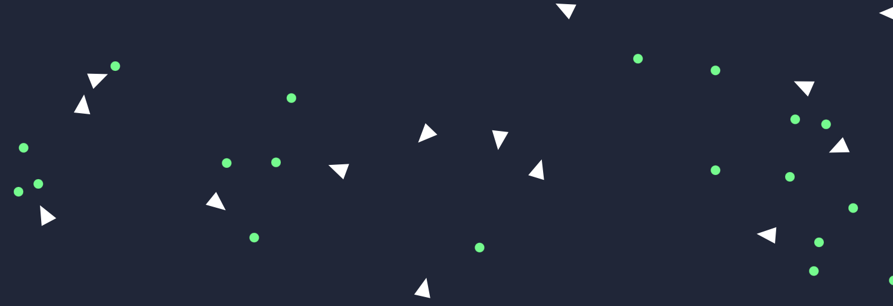
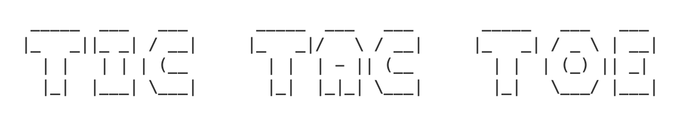
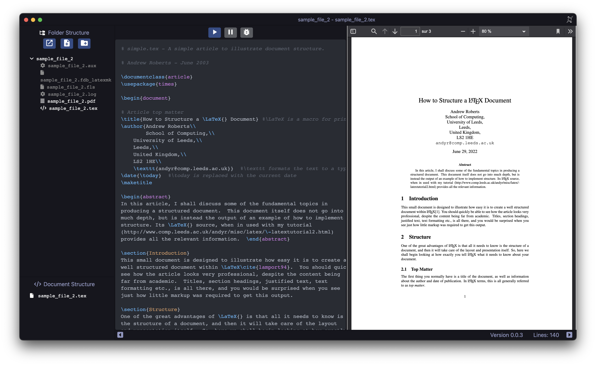
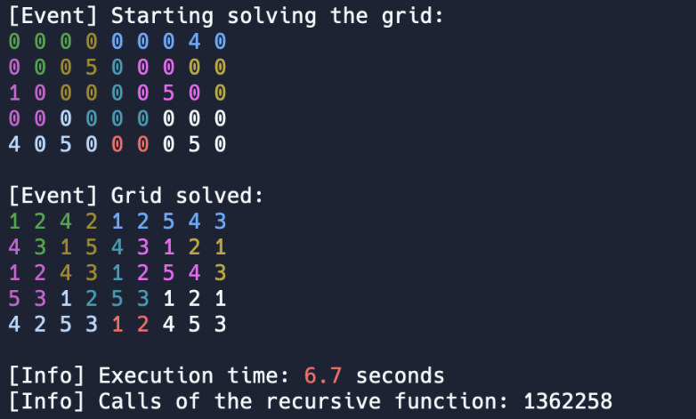
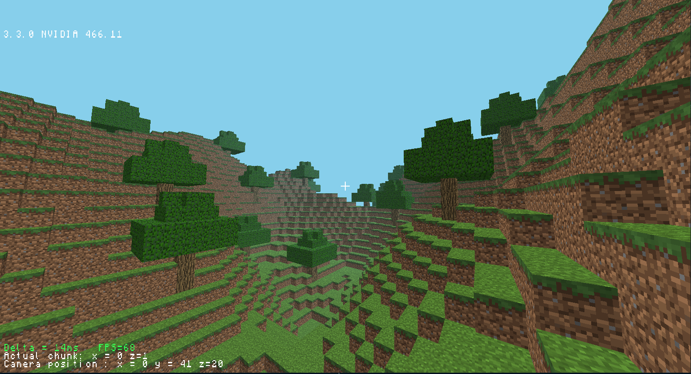
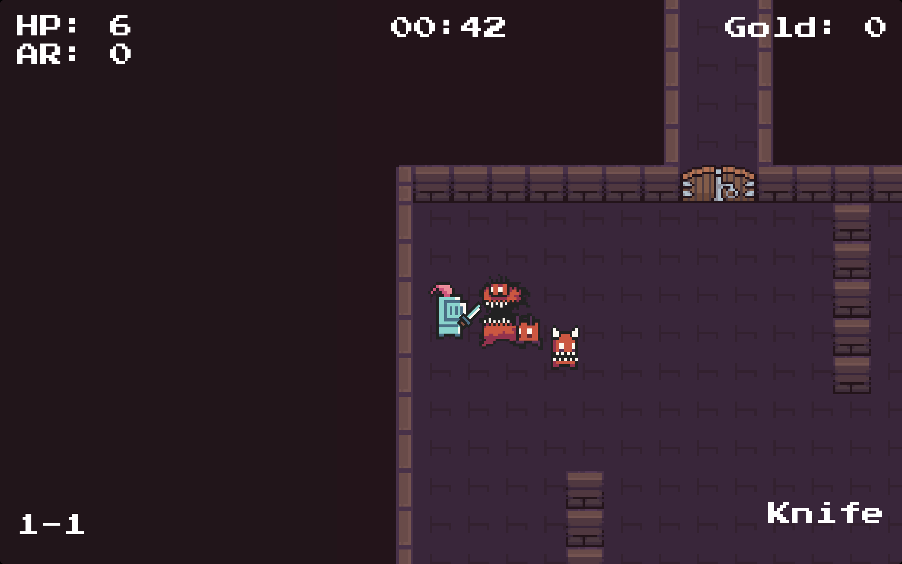

I've been programming since I was 10 years old. I mostly learned how to code from online courses, before taking more advanced computer science classes.

Here is a description of most of my programming projects, from the most recent one to the oldest. The complete repositories are available on [my GitHub profile](https://github.com/Red-Rapious).

---
### [Snake AI using Neural Networks and a Genetic Algorithm](https://github.com/Red-Rapious/Genetic-Snake-AI) - August 2023


This project is a sequel to both [MLP-Digits-Recognition](https://github.com/Red-Rapious/MLP-Digits-Recognition) and [Genetic-Birds-Simulator](https://github.com/Red-Rapious/Genetic-Birds-Simulator). I decided to apply the genetic algorithm approach to a situation more complicated than the last time, the game of [Snake](https://en.wikipedia.org/wiki/Snake_(video_game_genre)).

The goal was to build a simple Snake game, and to create an artificial intelligence to play the game, and hopefully get high enough scores.

### [Simulation of birds evolution using a Genetic Algorithm](https://github.com/Red-Rapious/Genetic-Birds-Simulator) - July 2023




This project is a kind of sequel to [MLP-Digits-Recognition](), an implementation of a neural network from scratch. This time, I used [this great tutorial](https://pwy.io/posts/learning-to-fly-pt1/) as a starting point, to train the neural network with a genetic algorithm, instead of backpropagation.

The goal was to teach birds (triangles) how to catch food (circles) by using learning mechanisms that simulate natural evolution. 

To do so, birds are represented by a small FFNN (Feed Forward Neural Network), initialized with random weights and biases. The input layer is connected to the "eye" of the bird, an array of "cells" that are activated depending on the position of nearby food. The learning process, a genetic algorithm, combines three steps: **selection** (two parents are selected), **crossover** (the genomes of parents are combined into a new one), and **mutation** (random changes to the child's genome). In this case, a bird's genome is an array of the weights and biases of its neural network.

This simulation, coded in Rust, is meant to be used using only a web browser, thanks to WebAssembly. See the instructions in the [project's README](https://github.com/Red-Rapious/Genetic-Birds-Simulator) to try it yourself.

### [Digits Recognition using a Multilayer Perceptron (MLP)](https://github.com/Red-Rapious/MLP-Digits-Recognition) - July 2023


This is one of my latest project, which was created following [3Blue1Brown's Neural Networks series](https://youtu.be/aircAruvnKk). The goal of it is to implement a Multilayer Perceptron (MLP) neural network from scratch in Rust, and use it to recognize handwritten digits from the [MNIST dataset](http://yann.lecun.com/exdb/mnist/).


This gave me a better understanding of how neural networks work, before extensively using frameworks like `TensorFlow` or `Keras`.

### [A multilingual Tic-Tac-Toe](https://github.com/Red-Rapious/Multilingual-Tic-Tac-Toe) - July 2023




The very first program I wrote entirely myself was a Tic-Tac-Toe that I coded in `C`, back in 2016. I still think that a Tic-Tac-Toe is a great mini-project to learn any programming language, so I decided to create this repository, with the same CLI program, written in various languages. 

### [Project Euler in Rust (problems 1-30)](https://github.com/Red-Rapious/Euler-Rust) - June 2023


```rust
pub fn problem9() -> i32 {
    for a in 1..998 {
        for b in 1..std::cmp::min(a, 999 - a) {
            let c = 1_000 - a - b;
            if a*a + b*b == c*c { return a*b*c }
        }
    }
    panic!();
}
```

Project Euler provides a set of great exercises to practice algorithmic, but I find the first problems quite good to learn a new language. Hence, I solved the first 30 [problems](https://projecteuler.net) in Rust to practice the language foundations.

### My [TIPE](https://fr.wikipedia.org/wiki/Travail_d%27initiative_personnelle_encadré): Car Computer Vision - 2022/2023


I worked on this machine learning project as part of my early engineering studies. The theme of the year was *The City*, and I decided to implement the [Viola-Jones method](https://en.wikipedia.org/wiki/Viola–Jones_object_detection_framework) to detect STOP signs in images.

---
### [Elements LaTeX](https://github.com/Red-Rapious/Elements-LaTeX) - July 2022




---
### [Animated Navier-Stokes Computational Fluid Dynamics (CFD) simulator](https://github.com/Red-Rapious/Navier-Stokes-CFD) - November & December 2021


While looking for interesting topics for my TIPE (see above), I came across [this amazing tutorial series](https://lorenabarba.com/blog/cfd-python-12-steps-to-navier-stokes/) on Computational Fluid Dynamics. While following the course, I decided to implement an animated version of the simulation, using `Matplotlib`.

### [Tektonik Solver 2000](https://github.com/Red-Rapious/Tektonik-Solver-2000) - October 2021


My maths teacher in 2021-2022 used to give us Tectonic Puzzles, a game similar to Sudoku. During the holidays, I decided to create a script to solve these, using backtracking.



The code is also [hosted on `repl.it`](https://replit.com/@redrapious/TektonikSolver2000#main.py), so you can go ahead and try the program in your browser, and even play with the code.

### [Minecraft Clone using OpenGL](https://github.com/Red-Rapious/Minecraft-Clone-OpenGL) - March & April 2021




---
### [Rankulstone](https://github.com/Red-Rapious/Rankulstone) - January 2020


A *League-of-Legends*-inspired card game I programmed and designed with friends before the release of *Legends of Runeterra*. This was my second important project using `Godot Engine`.

---
### [Project-Roguelike](https://github.com/Red-Rapious/Project-Roguelike) - July & August 2019


A summer project I developed in 2019. Inspired by games like *Enter the Gungeon* and *Soul Knight*, I created a rogue-like with some assets found on [`itch.io`](https://itch.io/game-assets).




I learned a lot about programming in general, game development and game design.