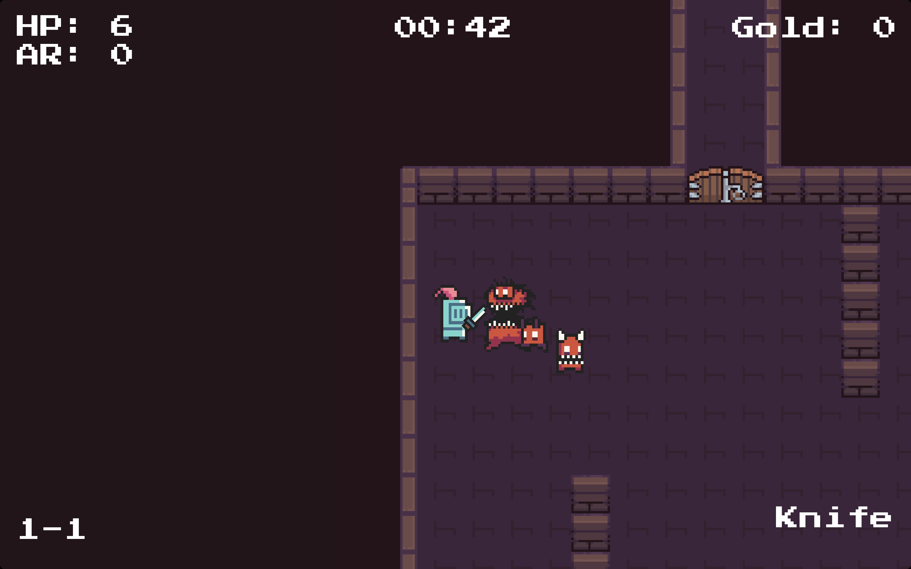

A summer project I developed in 2019. Inspired by games like *Enter the Gungeon* and *Soul Knight*, I created a rogue-like with some assets found on [`itch.io`](https://itch.io/game-assets).

I learned a lot about programming in general, game development and game design.