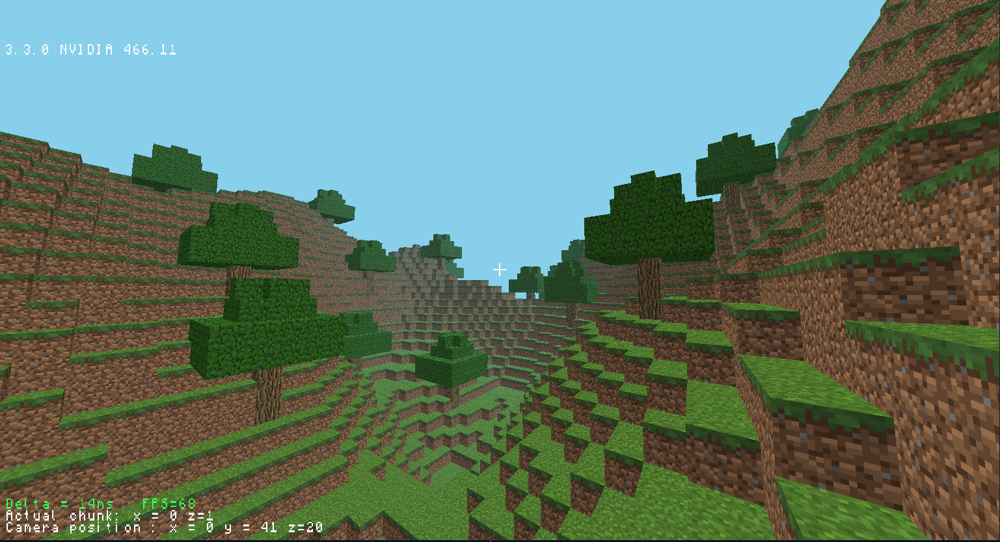

A clone of the famous Java game, coded entirely from scratch in C++ with OpenGL.

The game is build on a custom graphic engine, using the C++ bindings of OpenGL. Major features include:
- Optimised blocks rendering, to only render the apparent faces
- Ability to move the player's camera
- Render distance system with infinite chunks generation, while keeping GPU memory usage reasonable
- Random map generations, with mountains, grass, sand and trees, using Perlin Noise
- Simple shadow system
- Exponential fog for a more realistic look
- Text display with informations such as FPS