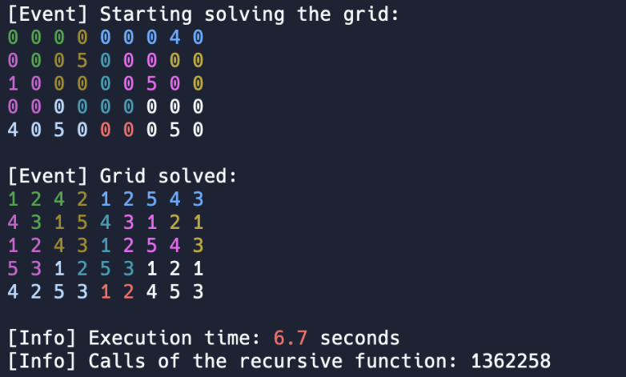

My maths teacher in 2021-2022 used to give us Tectonic Puzzles, a game similar to Sudoku. During the holidays, I decided to create a script to solve these, using backtracking.

The code is also [hosted on `repl.it`](https://replit.com/@redrapious/TektonikSolver2000#main.py), so you can go ahead and try the program in your browser, and even play with the code.