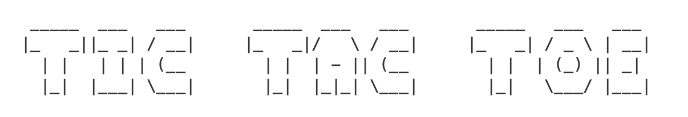

The very first program I wrote entirely myself was a Tic-Tac-Toe that I coded in `C`, back in 2016. I still think that a Tic-Tac-Toe is a great mini-project to learn any programming language, so I decided to create this repository, with the same CLI program, written in various languages. 