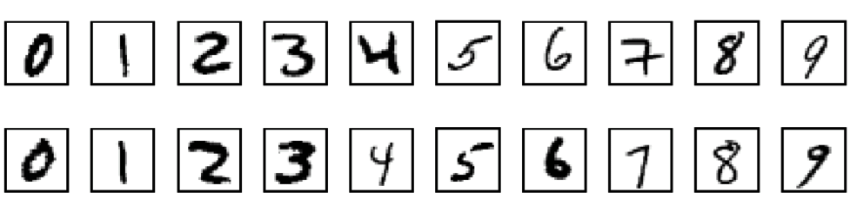

This is one of my latest project, which was created following [3Blue1Brown's Neural Networks series](https://youtu.be/aircAruvnKk). The goal of it is to implement a Multilayer Perceptron (MLP) neural network from scratch in Rust, and use it to recognize handwritten digits from the [MNIST dataset](http://yann.lecun.com/exdb/mnist/).

This gave me a better understanding of how neural networks work, before extensively using frameworks like `TensorFlow` or `Keras`.