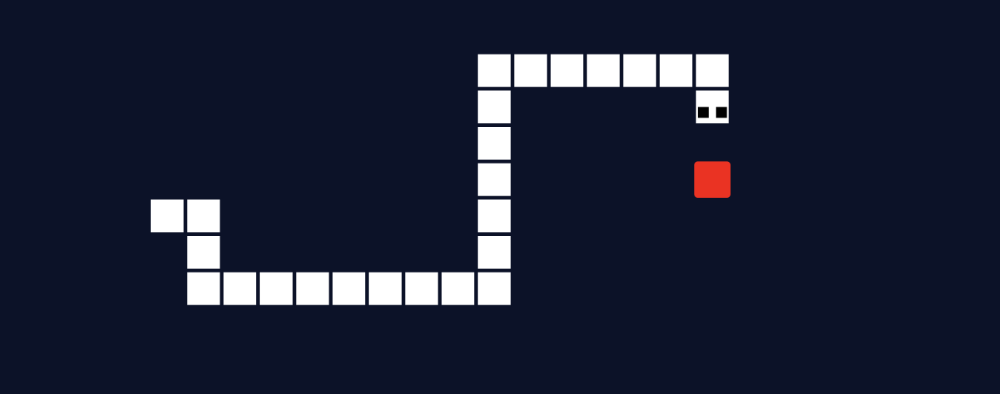

An Artificial Intelligence to play the game Snake, using a Genetic Algorithm.

## About
The goal was to build a simple Snake game, and to create an artificial intelligence to play the game, and hopefully get high enough scores.

<!---->

## Motivation
This project is a sequel to both [MLP-Digits-Recognition](https://github.com/Red-Rapious/MLP-Digits-Recognition) and [Genetic-Birds-Simulator](https://github.com/Red-Rapious/Genetic-Birds-Simulator). I decided to apply the genetic algorithm approach to a situation more complicated than the last time, the game of [Snake](https://en.wikipedia.org/wiki/Snake_(video_game_genre)).

## How it works
### The Brain
Each snake is given an artificial brain, represented by a Feed-Forward Neural Network. By default, the networks contains `8x3 = 24` input neurons, two intermediate layers of `18` neurons, and an output layer of `4` neurons.

The highest activation of the output layer decides the direction of the snake for the next move.

### The Eyes
The snake can see in 8 directions (including diagonals). For each direction, the snake is given 3 pieces of information:
- The distance to the apple
- The distance to the wall
- The distance to its tail

The greater the distance, the less the corresponding neuron is activated.

### The Genetic Algorithm
By default, each generation is made of 2000 snakes playing simultaneously. Once every single game is lost, the fitness of each snake is computed, increasing with the snake's lifetime, and the number of apples it has eaten. 

Then, the next generation is created using three steps:
- **Selection:** two parents are selected using Roulette Wheel Selection, meaning that the higher the fitness, the more chances a snake has to be selected.
- **Crossover:** the two parent's brain are fused to create the child's brain. I used to use Uniform Crossover, but instead changed for 1-Point Crossover to improve the training process.
- **Mutation:** noise is added to the weights and biases of the child's brain, using Gaussian Mutation.

On top of that, the best `n` snakes of each generations are saved and added to the next generation without alteration.

## Results
Using the defaults parameters, snakes tend to avoid walls after the 10th generation. Some snakes try to maximise their fitness function through lifetime by moving in circle, but are outperformed by the apple-seeking snakes after the 30th generation or so.

The best snakes of the 50th generations directly move towards apple, and manage to get scores between 15 and 20 in the given 500 maximum moves.

Overall, I have observed scores going up to 61 after around 120 generations. The main cause of death for high generations seem to be complex tail positions of which the snake cannot escape.