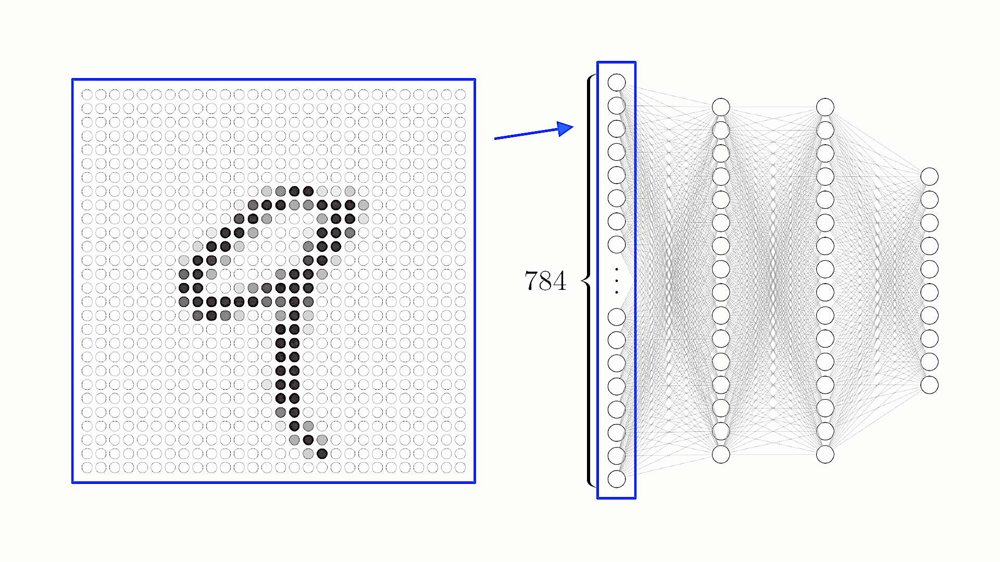
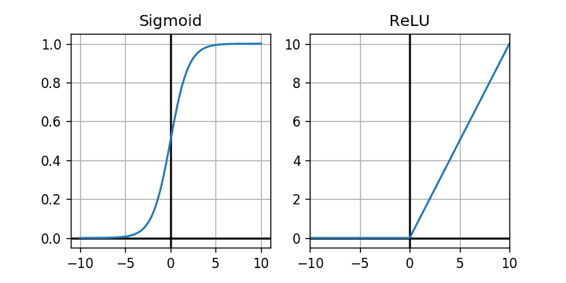

Welcome back to this series about digits recognition! Today, we'll directly dive in the center of our topic, by implementing the neural network.

After a quick recap about what we want to achieve, we will initialise our `Cargo` project and start coding a `struct` representing our neural network.

## The parts of our Neural Network
### The input
As you will see in Part 2, the images we'll be working with have a `28px` side. So, to be able to recognise the digits, we will need a kind of "machine" that takes `28px` images as an input. In our case, we don't care much about color, so we'll work with grayscale images. This means that each pixel have a value somewhere between `0` and `1`, `0` being the darkest black and `1` being the lighest white. Hence, the machine we need to build takes as an input `28*28 = 784` floating numbers between `0` and `1`.


Our image as an input. *(Credit: 3Blue1Brown)*
{: .text-center}

Code-wise, our neural network will then take as an input a `Vec<f64>`, of size `784`.

**Note:** For this tutorial, I decided to use `Vector`s to represent many structures. There's multiple alternatives, like using arrays, or even vectors and matrices from the [`nalgebra`](https://www.nalgebra.org) crate (more on that later). For the sake of simplicity, we'll stick with `Vector`s since they can be dynamically allocated.
{: .notice--info}

### The output
To be fair, there's multiple ways to represent the output of our machine. We want it to return an integer between `0` and `9`, but neural networks, as we'll see, don't work much with integers, but instead with floating numbers.

So how can our neural network tell us which digit it detected? By using `10` outputs, one corresponding to each digit. We will then check which output is the most "activated", and deduce the corresponding digit. In fancy terms, we will take the [`argmax`](https://en.wikipedia.org/wiki/Arg_max) of the output layer.

### The intermediate layers
The choice of the number and sizes of intermediate layers is kind of... random? As long as the intermediate layers are not too small nor too large, we should be good. And one great thing about coding, is that you can adjust things up at the end. 

Hence, I chose **two** intermediate layers, of **`16` neurons each** (kind of a reference to 3Blue1Brown's video), but out implementation of the neural network will take these as an argument, making it *super-convenient* to change later on. 

To do so, we'll store the size of each layer inside a `Vec<usize>`. If the intermediate layers can be changed by the "user", we'll have to make sure that the first element of the `Vec` is a layer of `784` input neurons, and that the last one is a layer of `10` output neurons.

### But how does a neural network propagate activation?
> TODO

### Weights and biases
That being said, we will represent the weights as matrices, and biases as vectors (in the linear algebra way). To keep things consistent, we will have a `Vec`-only approach of representing our weights and biases. This means that the weights between two layers will be a `Vec<Vec<f64>>`, and that the biases will be a `Vec<f64>`.

**Note:** Hand-coding the linear algebra part is, in my opinion, the best way to keep it simple. Nevertheless, if you're feeling confident and not afraid to adapt some code I'll write, using [`nalgebra`](https://www.nalgebra.org/docs/user_guide/getting_started), a linear algebra library, will be much more efficient, and you won't have to write some boring matrix multiplication functions.
{: .notice--info}

### The activation function
To make things a bit more general, our neural network object will take the activation function as an argument. We will only implement two different ones, [`Sigmoid`](https://en.wikipedia.org/wiki/Sigmoid_function) and [`ReLU`](https://en.wikipedia.org/wiki/Rectifier_(neural_networks)), but we'll make sure that adding a new one is quite simple.


The graphs of Sigmoid and ReLU.
{: .text-center}

## Let's code!
Enough tchit-tchat, let's get to the fun part, shall we?
### Project initialisation
We'll use [`Cargo`](https://doc.rust-lang.org/book/ch01-03-hello-cargo.html) to simplify the setup of our project. Enter in your terminal:
```console
$ cargo new digits_recognition
```

`Cargo` will then create for you a new folder containing default files:
```
digits_recognition
├── src
│   └── main.rs
├── Cargo.toml
└── .gitignore
```

If you enter this new folder, you can make sure that eveything is working by *running* the project:
```console
$ cd digits_recognition
$ cargo run
   Compiling digits_recognition v0.1.0 (.../digits_recognition)
    Finished dev [unoptimized + debuginfo] target(s) in 0.99s
     Running `target/debug/digits_recognition`
Hello, world!
```

So far, so good.

### The `NeuralNetwork` struct
Let's keep things clean and avoid coding directly in the `main.rs` file, that we will use later as a launcher. Let's create a new `neural_network.rs` file in the `src` folder, and add a simple `struct` called... `NeuralNetwork`.

```rust
/// A structure containing the actual neural network layers, weights, and biases.
struct NeuralNetwork;
```

In the `main.rs` file, also add on top:
```rust
mod neural_network;
```
This is not absolutely mandatory right now, but if you're using `rust-analyser` - and you should, it will take into account the new file.

What does our neural network need? A way to store the layers sizes, plus weights, biases, and an activation function:

```rust
/// A structure containing the actual neural network layers, weights, and biases.
pub struct NeuralNetwork {
    /// The number of neurons in each layer, including first and last layers.
    layers: Vec<usize>,
    /// The weight of each synapse.
    weights: Vec< Vec<Vec<f64>> >,
    /// The bias of each synapse.
    biases: Vec< Vec<f64> >,
    /// The activation function and its derivative.
    activation_function: ...
}
```

**Note:** I use `///` to add documentation comments, that will be nicely displayed when hovering identifiers, with tools like `rust-analyser`.
{: .notice--info}

We already discussed the representation of one weight matrix, and one bias vector. Here, we contain them in a new `Vec`: `weights` is a `Vector` of matrices. Same goes for `biases`, a `Vector` of vectors.

We simply need to find a way to represent our activation function. We *could* store directly a function with type `f64 -> f64`, but there's two issues with this. First, it's not easy in Rust: the type `dyn Fn(f64) -> f64` cannot easily be stored, and passing it as an argument everytime we need to use it is quite ugly. Second, we do not only need the activation function, but also its derivative. Hence, it would be clean to be able to "group up" a function and its derivative. 

<!--The way I decided to approach it is by using a `Trait`. If you're not familiar with traits, you can see it as a way to ask for a generic object with specific methods that you can call from it. For instance, let's create an `ActivationFunction` trait:
```rust
pub trait ActivationFunction {
    fn activate(&self, x: f64) -> f64;
}
```
This way, we can simply ask our `activation_function` field from `NeuralNetwork` to store *any object that implements the `ActivationFunction` trait*:
```rust
pub struct NeuralNetwork {
    ...
    /// The activation function and its derivative.
    activation_function: dyn ActivationFunction
}
```-->

The simplest way I found is to create a dedicated `struct` for our activation function. For now, let's just create a new `struct`:
```rust
pub struct ActivationFunction;
```
And specify that we want the `activation_function` field from `NeuralNetwork` to be of type `ActivationFunction`:
```rust
pub struct NeuralNetwork {
    ...
    /// The activation function and its derivative.
    activation_function: ActivationFunction
}
```
We will handle the methods from `ActivationFunction` when we will need them.

### Network initialisation
Now that we have our `struct` outline, we will need a way to create a new, random neural network. Let's call this function `random`. Since our weights and biases will be random, we only take `layers` and `activation_function` as arguments:

```rust
impl NeuralNetwork {
    /// Initialise a new Neural Network with random weights and biases.
    pub fn random(
        layers: Vec<usize>, 
        activation_function: ActivationFunction
        ) -> Self {
        
        Self {
            layers,
            weights: todo!(),
            biases: todo!(),
            activation_function
        }
    }
}
```

**Tip:** The `todo!` macro comes very handy to write parts of your code later, while making sure that Rust and `cargo check` understands that's there's no bug. This avoids having your entire screen red because of errors when using the handy `rust-analyser`.
{: .notice--info}

#### Random weights and biases
To build the `Vector`s containing the weights and biases, we'll start with an empty `vec![]`, and progressively add the generated matrices/vectors. The hard part is to keep in my the dimensions of the matrices we want: the weights connecting the layer number $i$ to the layer number $i+1$ needs to have `layers[i+1]` lines and `layers[i]` columns.
```rust
// Initially empty vectors
let mut weights = vec![];
let mut biases = vec![];

// Note the -1: the output layer is not connected to anything
for i in 0..layers.len()-1 { 
    let mut w_matrix = vec![];
    let mut b_vector = vec![];

    for _ in 0..layers[i+1] {
        // Push a random bias in the biases vector
        b_vector.push(todo!()); 
        // TODO: generate a random number

        // Push a random line of weights in the matrix
        let mut line = vec![];
        for _ in 0..layers[i] {
            line.push(todo!());
            // TODO: generate a random number
        }
        w_matrix.push(line);
    }
    weights.push(w_matrix);
    biases.push(b_vector);
}
```
The only part now missing is the actual random numbers.

To generate random weights and biases, we will need a random numbers generator, provided by the `rand` crate. While we're at it, let's also add the `rand-distr` crate to our project; it will allow us to specify to [probability distribution](https://en.wikipedia.org/wiki/Normal_distribution) of our number generator. Basically, we want our random numbers to be distributed somewhere around `0.0`.

To add the crates to your project, insert the following lines to your `Cargo.toml` file:
```
...

[dependencies]
rand = "0.8.4"
rand_distr = "0.4.2"
```
And include the crates in your project by adding, at the beginning of your `neural_network.rs` file:
```rust 
use rand_distr::{Normal, Distribution};
```

The base code to generate a random number, using the normal distribution, will be:
```rust
// Normal distribution sampler
let normal = Normal::new(0.0, 1.0).unwrap(); 
// 0 is the mean, and 1 is the standard deviation

// Random number generator
let mut rng = rand::thread_rng();

// Generated number
let number = normal.sample(&mut rng);
```

Let's add this to the code we previously written:
```rust
// Normal distribution sampler
let normal = Normal::new(0.0, 1.0).unwrap(); 
// Random number generator
let mut rng = rand::thread_rng();

...

for i in 0..layers.len()-1 { 
    ...

    for _ in 0..layers[i+1] {
        // Push a random bias in the biases vector
        b_vector.push(normal.sample(&mut rng)); 

        ...

        for _ in 0..layers[i] {
            // Push a random weight in the weights matrix line
            line.push(normal.sample(&mut rng));
        }

        ...
    }
    ...
}
```

Putting it all together:
```rust
pub fn random(layers: Vec<usize>, activation_function: ActivationFunction) -> Self {
    let normal = Normal::new(0.0, 1.0).unwrap(); 
    let mut rng = rand::thread_rng();

    let mut weights = vec![];
    let mut biases = vec![];

    for i in 0..layers.len()-1 { 
        let mut w_matrix = vec![];
        let mut b_vector = vec![];

        for _ in 0..layers[i+1] {
            b_vector.push(normal.sample(&mut rng)); 

            let mut line = vec![];
            for _ in 0..layers[i] {
                line.push(normal.sample(&mut rng));
            }
            w_matrix.push(line);
        }
        weights.push(w_matrix);
        biases.push(b_vector);
    }
    
    Self { layers, weights, biases, activation_function }
}
```


### Feeding forward
Creating a new neural network is nice, but using it is even better. So, let's implement a feed-forward function. 

What we want to do, is tell the neural network "Hey, take this 784-long `Vec<f64>`, and give me a 10-long `Vec<f64>` back":
```rust 
/// Computes the activations of the output layer, given the activations of the input layer.
pub fn feed_forward(&self, mut activation: Vec<f64>) -> Vec<f64> {
    todo!()
}
```

This process is called feed-forward, because the neural network will actually compute the activations layer by layer, going forward from the input layer towards the output layer. As a reminder, to move from one layer to the next one, the different steps are:
- Multiply the latest activation vector by the weights matrix
- Add the biases to it
- Apply each the activation function to each coefficient

#### Function outline
This translates pretty smoothly into code:
```rust
/// Computes the activations of the output layer, given the activations of the input layer.
pub fn feed_forward(&self, mut activation: Vec<f64>) -> Vec<f64> {
    for i in 0..self.layers.len()-1 {
        // Multiply the activation by the weights matrix
        activation = self.weights[i] * activation;

        // Add the biases
        activation += self.biases[i];
        
        // Apply the activation function to each coefficient
        for i in 0..activation.len() {
            activation[i] = self.activation_function.activation(activation[i]);
        }
    }
    activation
}
```
*oh waitt* this is not Python, so we can't just mutliply and add `Vec`s...

Well then, let's get into...
#### Unoptimised linear algebra
Programming matrix multiplication and linear algebra in general is an entire topic, [dare I say an art](https://gist.github.com/nadavrot/5b35d44e8ba3dd718e595e40184d03f0). But today, for the sake of simplicity, we're not gonna do art. 

We have to code two functions: one to multiply a matrix by a vector, and one to add a vector to another vector. Let's create a new file called `linear_algebra.rs`, and add our two functions outlines:

```rust
/// Given a matrix `A` and a vector `X`, returns the vector `AX`.
pub fn matrix_vector_product(matrix: &Vec<Vec<f64>>, vector: &Vec<f64>) -> Vec<f64> {
    assert_eq!(matrix[0].len(), vector.len(), "The matrix and vector shapes are incompatible.");

    todo!()
}

/// Given one mutable vector `X1` and another vector `X2` of the same size, adds `X2` to `X1`.
pub fn vectors_sum(vector1: &mut Vec<f64>, vector2: &Vec<f64>) {
    assert_eq!(vector1.len(), vector2.len(), "The two vectors have different sizes.");

    todo!()
}
```

The simple part first: `vectors_sum`, which is close to trivial.
```rust
/// Given one mutable vector `X1` and another vector `X2` of the same size, adds `X2` to `X1`.
pub fn vectors_sum(vector1: &mut Vec<f64>, vector2: &Vec<f64>) {
    assert_eq!(vector1.len(), vector2.len(), "The two vectors have different sizes.");

    for i in 0..vector1.len() {
        vector1[i] += vector2[i];
    }
}
```
Even though, there's a few things worth mentionning:
- Note that we use references (`&`) as arguments. This allows Rust to avoid moving the vectors, which makes the code much more efficient. Without references, Rust would actually complain, because it knows that moving `Vec`s is time-consuming.
- Only the first reference is mutable (`mut`). Makes sense, we do not want to modify the bias vector.
- Our function does not return anything: the function will be called, the first vector will be modified, but nothing is returned. This is actually much more efficient than allocating new memory for the result of `vector1 + vector2`, and using this new memory space as our base for future operations.

Now, let's get to the though one. If you forgot [how to multiply a matrix and a vector]() by hand, try to reactivate your memory before actually entering the coding part.
```rust
/// Given a matrix `A` and a vector `X`, returns the vector `AX`.
pub fn matrix_vector_product(matrix: &Vec<Vec<f64>>, vector: &Vec<f64>) -> Vec<f64> {
    assert_eq!(matrix[0].len(), vector.len(), "The matrix and vector shapes are incompatible.");

    // Initialise an empty vector
    let mut result = Vec::with_capacity(matrix.len());
    for j in 0..matrix.len() {
        result.push(0.0); // add a null coefficient to the vector

        for i in 0..vector.len() {
            // add the result of the multiplication to the coefficient
            result[j] += matrix[j][i] * vector[i]
        }
    }
    result
}
```
Let's see how my previous remarks translate to the new function:
- We also use references, for the same reasons.
- Our function does return a new `Vec`. It's not as efficient as our first function, but there is not simple way to avoid it.
- Both references are unmutable. Since we're not modifying anything, but starting fresh, we do not need to have mutable objects.

#### Activation function
We can't procrastinate the coding of `ActivationFunction` any further. In `feed_forward`, we wrote:
```rust
activation[i] = self.activation_function.activation(activation[i]);
```
Therefore, we have to build the `activation` function, of `ActivationFunction`.

For now, all we have is an empty `struct`:
```rust
pub struct ActivationFunction;
```
What we will do, is instead of storing the activation **function**, we will only store its **type**. Then, when we'll call `activation_function.activation`, we'll return the adapted result depending on the stored type.

The type will be an enum:
```rust
pub enum ActivationFunctionType {
    Sigmoid,
    ReLU
}

pub struct ActivationFunction {
    /// The activation function, which will dictate the main function and its derivative.
    function_type: ActivationFunctionType
}

impl ActivationFunction {
    /// Create a new ActivationFunction of given type.
    pub fn new(function_type: ActivationFunctionType) -> Self {
        ActivationFunction { function_type }
    }
}
```

And the `activation` function looks like this:
```rust
/// The main activation function, depends on the type.
pub fn activation(&self, x: f64) -> f64 {
    match self.function_type {
        ActivationFunctionType::Sigmoid => sigmoid(x),
        ActivationFunctionType::ReLU => ReLU(x)
    }
}

/// Logistic function.
fn sigmoid(x: f64) -> f64 {
    1.0 / (1.0 + (-x).exp())
}

/// Rectification function.
#[allow(non_snake_case)]
fn ReLU(x: f64) -> f64 {
    f64::max(x, 0.0)
}
```

**Note:** Calling a function `ReLU` upsets Rust a little, since it does not respect the [`snake_case` **naming convention**](). As a general rule of thumb, one should always follow Rust's conventions. But this time, just this time, we'll make an exception, since this makes more sense than `relu`, which isn't the common spelling. To tell Rust "don't worry, I know what I'm doing", we just have to disable the warning with the `#[allow(non_snake_case)]` line above the function's name.
{: .notice--info}

We now have all the parts to have a working `feed_forward` function! Let's put it all together:

```rust
use crate::linear_algebra::*; // Includes the linear algebra functions from the other file

/// Computes the activations of the output layer, given the activations of the input layer.
pub fn feed_forward(&self, mut activation: Vec<f64>) -> Vec<f64> {
    for i in 0..self.layers.len()-1 {
        // Multiply the activation by the weights matrix
        activation = matrix_vector_product(&self.weights[i], &activation);
        // Add the biases
        vectors_sum(&mut activation , &self.biases[i]);
        
        // Apply the activation function to every coefficient
        for i in 0..activation.len() {
            activation[i] = self.activation_function.activation_function(activation[i]);
        }
    }
    activation
}
```

**Note:** We can use a more idiomatic Rust syntax instead of the last `for` loop: `activation = activation.iter().map(self.activation_function.activation).collect();`. Iterators are a center part of Rust, but can be a bit tricky when coming from other programming languages. What we simply do here, is iterate over the elements of activation with `.iter()`, then map the activation function to each element using `.map(...)`. Finally, we transform our modified iterator back to a `Vec` using `.collect()`.
{: .notice--info}

That was a lot of code for what looked like a simple function. But that's the price to pay for not using slightly complex crates such as `nalgebra`. Even though, I find that understanding basic matrix multiplication is much needed when you're using matrices. Now, don't worry, we're almost done with the neural network.

### Prediction
To have a fully working, untrained digit recogniser, we just need to transform the activations of output layers into... a digit. Compared to what we just did, it will look like a piece of cake. Let's code a `predict` function, that takes an "image" as an input (*de facto*, a `784`-long `Vec<f64>`), and that returns a digit (stored as a `u8` integer):

```rust
/// Predicts the digit in a given image.
pub fn predict(&self, input: Vec<f64>) -> u8 {
    // Get the output layer's activations
    let result = self.feed_forward(input);

    // Select the highest activation of the output layer.
    let mut maxi = (result[0], 0);
    for i in 1..result.len() { // we start at 1, since values of index 0 is already set as the current maxi
        if result[i] > maxi.0 {
            maxi = (result[i], i);
        }
    }
    maxi.1 as u8
}
```

## Wrapping it up
Good job, Part 1 is done! Let's summarize it all.
### What we've done
We've coded a lot of important parts of our neural network:
- The random initialisation
- The `feed_forward` mechanism, with its linear algebra functions
- A nice way to store different activation functions
- The `predict` function

### What we will do next time
Next time, we'll actually *use* the neural network! We'll start by loading some images, then we'll predict which digit they contain with our random neural network. See you next time!