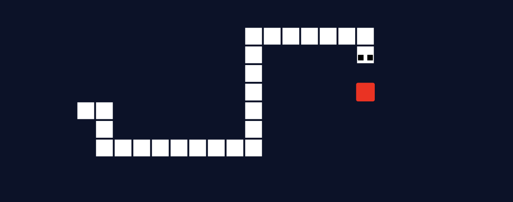

Hi, I'm a student from France, studying **Computer Science** and **Mathematics**.

In my personnal projects, I explored diverse topics including **Deep Learning**, **Computer Graphics** and **Board Games AIs**.

You can explore my Project History [here](https://red-rapious.github.io/project-history/).

## Latest projects
This summer, I've been working on **Deep Learning**:
- [**MLP-Digits-Recognition**:](https://github.com/Red-Rapious/MLP-Digits-Recognition) I started by implementing a Multilayer Perceptron from scratch in Rust, to recognize handwritten digits from the MNIST dataset.

- [**Genetic-Birds-Simulator**:](https://github.com/Red-Rapious/Genetic-Birds-Simulator) I explored Genetic Algorithms with this simple simulation of birds evolution.

- [**Genetic-Snake-AI**:](https://github.com/Red-Rapious/Genetic-Snake-AI) I adapted this learning approach to an Artificial Intelligence designed to beat the classic game of Snake.

## Previous projects
- I built [Elements LaTeX](https://github.com/Red-Rapious/Elements-LaTeX), an Electron-based LaTeX editor.
- You can also check out [my biggest project yet](https://github.com/Red-Rapious/MinecraftCloneOpenGL), an implementation of Minecraft using my own, handmade, graphics engine.
- I created [an animated CFD simulator](https://github.com/Red-Rapious/Navier-Stokes-CFD) using the Navier-Stokes equations, you can easily try to run it with `Python` and `Matplotlib` *(in French only)*